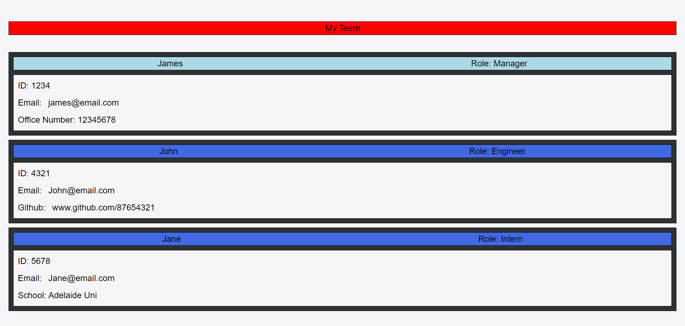

The purpose of this project is to provide managers with basic information about their team
including their roles, emails, and github information

By running an "NPM install" followed by "node index.js" the user is presented with a list of questions.
Once the questions have been answered a HTML file  is generated with this information laid out for the user. 
When the user selects either the team member's email or github link, they are taken to the appropriate web page.

Below is a screenshot of a sample HTML page which can be found in this repository:

